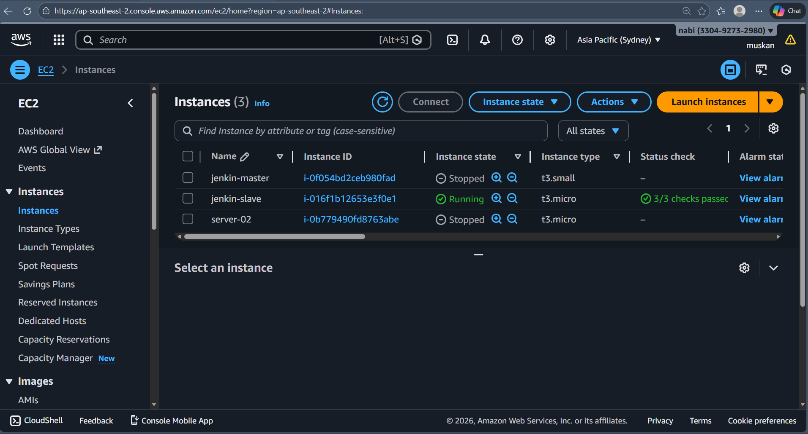
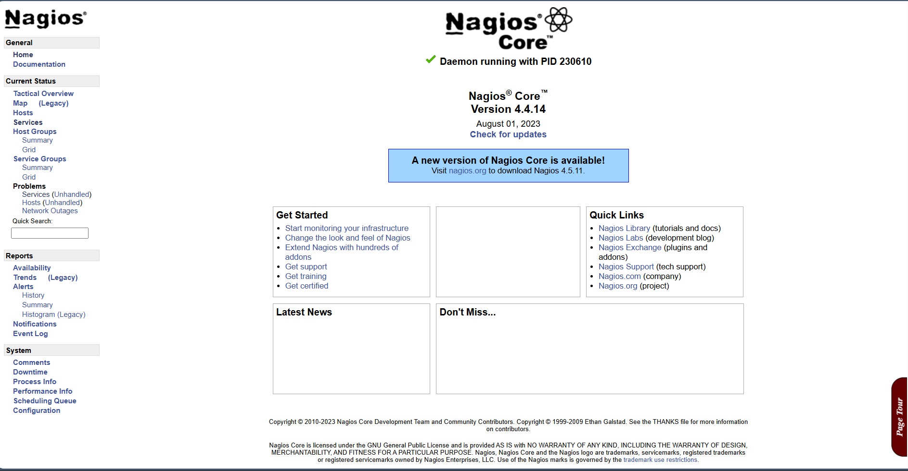
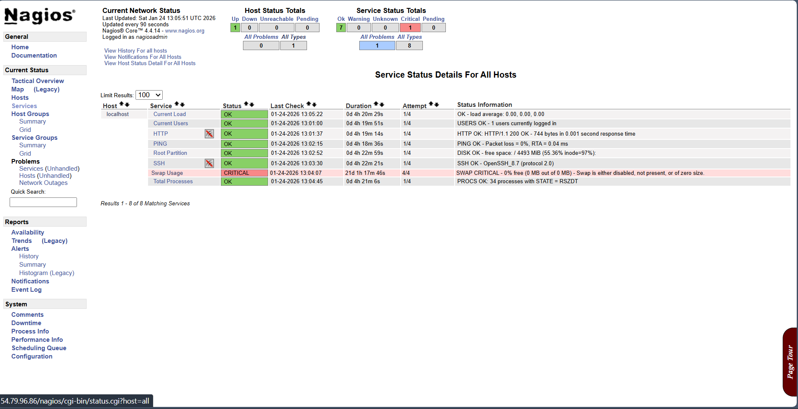

# Nagios Server Monitoring Project

# Objective :
Monitor CPU usage of an EC2 server using Nagios Core.

## Technologies Used
- AWS EC2
- Amazon Linux
- Nagios Core
- Apache
- Linux Commands

## Prerequisites
- AWS Account
- EC2 Instance
- Basic Linux Knowledge
- Internet Connection
- 
# Features :
- Nagios Core compiled from source
- Web-based monitoring dashboard
- CPU Load monitoring

## Installation Steps

1. Launch EC2 instance.
2. Connect to EC2 using SSH.
3. Update system packages.
4. Install required dependencies.
5. Download Nagios Core.
6. Compile and install Nagios.
7. Install Nagios plugins.
8. Start Nagios and Apache service.

## Project Outcome

Successfully installed and configured Nagios Core on AWS EC2 
and monitored CPU performance with alert system.
CPU usage is monitored in real time with OK/WARNING/CRITICAL states.

## Access Nagios Dashboard

Open browser and type:

http://<Your-EC2-Public-IP>/nagios

Login using:
Username: nagiosadmin
Password: (your created password) 

##ScreenShots :

#You Can Connect With Me
## 👤  LinkedIn
🔗 LinkedIn: https://www.linkedin.com/in/muskaan-tandel-b59bb8343/
